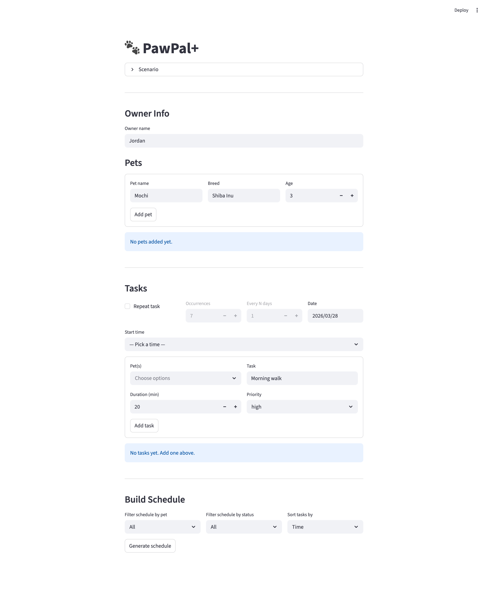

# PawPal+ (Module 2 Project)

You are building **PawPal+**, a Streamlit app that helps a pet owner plan care tasks for their pet.

## Scenario

A busy pet owner needs help staying consistent with pet care. They want an assistant that can:

- Track pet care tasks (walks, feeding, meds, enrichment, grooming, etc.)
- Consider constraints (time available, priority, owner preferences)
- Produce a daily plan and explain why it chose that plan

Your job is to design the system first (UML), then implement the logic in Python, then connect it to the Streamlit UI.

## What you will build

Your final app should:

- Let a user enter basic owner + pet info
- Let a user add/edit tasks (duration + priority at minimum)
- Generate a daily schedule/plan based on constraints and priorities
- Display the plan clearly (and ideally explain the reasoning)
- Include tests for the most important scheduling behaviors

## Features

- **Sorting by time** — schedules are displayed in chronological order using the scheduler's time-sorting logic so owners can quickly see the day at a glance.
- **Priority-based scheduling** — higher-priority tasks are scheduled before lower-priority ones, helping important care like medication or feeding get placed first.
- **Priority-aware views** — the schedule can also be sorted by priority first, then by time, and high/medium/low tasks are labeled with emoji badges in the UI.
- **Conflict warnings** — the scheduler detects overlapping tasks and the Streamlit UI presents clear warnings that explain which pet, which tasks, and what times are in conflict.
- **Pinned start times** — users can request a specific task time, and the scheduler preserves or adjusts that request as needed to avoid overlap.
- **Daily recurrence** — recurring tasks use lazy recurrence, meaning the first task is scheduled immediately and the next occurrence is created after the current one is completed.
- **Next available slot recommendation** — the scheduler can suggest the next open slot for a given pet, date, and duration, which is surfaced in the Streamlit task form.
- **Automatic re-scheduling** — when tasks are added, removed, or completed, the daily plan is recalculated so the visible schedule stays consistent.
- **Multi-pet planning** — separate daily plans are maintained per pet, allowing owners to manage different routines without mixing schedules together.
- **JSON persistence between runs** — owner info, pets, tasks, and daily plans are saved to `data.json` and reloaded when the app starts.
- **Status filtering and completion tracking** — users can filter pending vs. completed work and mark tasks done directly from the app.
- **Helpful schedule explanations** — the schedule view explains why tasks were ordered the way they were, making the planning behavior easier to understand.

## App Preview



## Getting started

### Setup

```bash
python -m venv .venv
source .venv/bin/activate  # Windows: .venv\Scripts\activate
pip install -r requirements.txt
```

### Suggested workflow

1. Read the scenario carefully and identify requirements and edge cases.
2. Draft a UML diagram (classes, attributes, methods, relationships).
3. Convert UML into Python class stubs (no logic yet).
4. Implement scheduling logic in small increments.
5. Add tests to verify key behaviors.
6. Connect your logic to the Streamlit UI in `app.py`.
7. Refine UML so it matches what you actually built.


## Smarter Scheduling

The scheduling engine in `pawpal_system.py` goes beyond a simple task list:

- **Priority-first ordering** — tasks are sorted by descending priority before slot assignment, so high-priority care (e.g. medication) is always placed first.
- **Priority-then-time display sorting** — once tasks are scheduled, the UI can present them by urgency first and then by time for easier review.
- **Overlap-free placement** — each task is placed at the next free `:00` or `:30` boundary using half-open interval checks, guaranteeing no two tasks share the same time window.
- **User-pinned start times** — a task can carry a `user_start_time` that anchors it to an exact slot; auto-scheduled tasks flow around pinned ones without displacing them.
- **Recurring task support** — `schedule_recurring()` stamps the first occurrence onto the calendar and records the repeat interval (`recur_days`) and remaining count (`recur_remaining`) on the task, ready for a background process to spawn future copies.
- **Next available slot search** — `Scheduler.next_available_slot()` finds the next valid opening for a requested duration based on the current plan windows.
- **Conflict detection** — `Scheduler.detect_conflicts()` scans a plan and returns every overlapping task pair, making it easy to surface scheduling problems in the UI.
- **Live re-scheduling** — adding or removing a task triggers `adjust_plan()`, which reruns the full schedule so the displayed plan is always consistent.

## Agent Mode Notes

Agent Mode was used as part of the implementation workflow for the persistence and advanced scheduling upgrade. I delegated the `pawpal_system.py` and `app.py` planning slice to an agent with explicit ownership instructions so it could map where JSON persistence, slot recommendation, and UI priority formatting needed to land without conflicting with the rest of the codebase.

In practice, the agent’s most useful contribution was reconnaissance: it re-read the backend, UI, and docs, confirmed the correct insertion points, and surfaced that persistence should live on `Owner` with custom dictionary-based serialization rather than an extra library. I then integrated the final code locally after the agent hit a patch mismatch, which kept the architecture consistent while still using Agent Mode as part of the design-and-execution process.

## Testing PawPal+

Run the automated test suite with:

```bash
python -m pytest
```

The tests cover core scheduling behaviors including chronological task ordering, priority-based scheduling, overlap prevention, conflict detection, task completion, deletion and rescheduling, pet and multi-date plan management, and lazy recurring-task behavior where the next occurrence is created after the current one is completed.

The suite now also covers JSON save/load persistence and next-available-slot recommendation logic.

**Confidence Level:** 4/5 stars. The current suite passes (`79 passed`) and gives strong coverage of the main scheduling flows and edge cases, though the app would still benefit from deeper UI-level and end-to-end testing for additional confidence.
